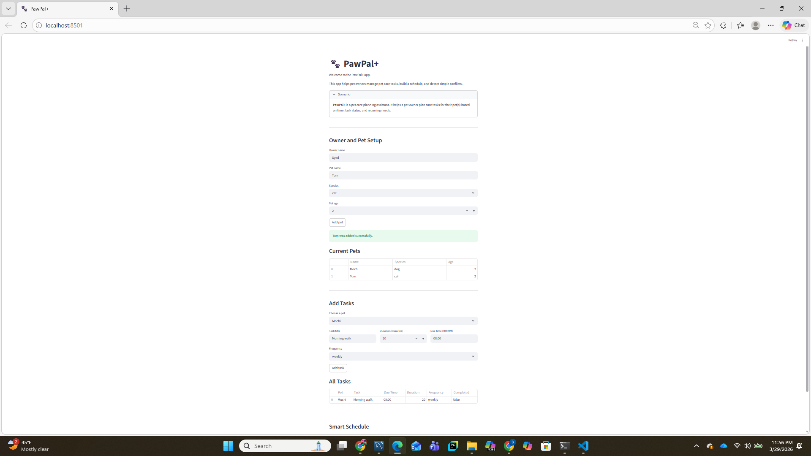

# PawPal+ (Module 2 Project)

You are building **PawPal+**, a Streamlit app that helps a pet owner plan care tasks for their pet.

## Scenario

A busy pet owner needs help staying consistent with pet care. They want an assistant that can:

- Track pet care tasks (walks, feeding, meds, enrichment, grooming, etc.)
- Consider constraints (time available, priority, owner preferences)
- Produce a daily plan and explain why it chose that plan

Your job is to design the system first (UML), then implement the logic in Python, then connect it to the Streamlit UI.

## What you will build

Your final app should:

- Let a user enter basic owner + pet info
- Let a user add/edit tasks (duration + priority at minimum)
- Generate a daily schedule/plan based on constraints and priorities
- Display the plan clearly (and ideally explain the reasoning)
- Include tests for the most important scheduling behaviors

## Getting started

### Setup

```bash
python -m venv .venv
source .venv/bin/activate  # Windows: .venv\Scripts\activate
pip install -r requirements.txt
```

### Suggested workflow

1. Read the scenario carefully and identify requirements and edge cases.
2. Draft a UML diagram (classes, attributes, methods, relationships).
3. Convert UML into Python class stubs (no logic yet).
4. Implement scheduling logic in small increments.
5. Add tests to verify key behaviors.
6. Connect your logic to the Streamlit UI in `app.py`.
7. Refine UML so it matches what you actually built.

## Smarter Scheduling

PawPal+ now includes smarter scheduling features to make pet care planning more useful:

- Sorts tasks by due time
- Filters tasks by pet name or completion status
- Automatically creates the next recurring task for daily and weekly activities
- Detects simple scheduling conflicts when two tasks are assigned at the same time

These features were verified through the CLI demo in `main.py` and automated tests with `pytest`.

## Testing PawPal+

To run the automated test suite:

```bash
python -m pytest

- The tests cover key PawPal+ behaviors, including:

task completion
adding tasks to a pet
sorting tasks in chronological order
recurring daily task creation
filtering tasks by pet name
detecting scheduling conflicts
handling pets with no tasks

- Confidence Level: ★★★★☆ (4/5)

- I am confident that the core scheduling logic works correctly because the main features are covered by automated tests. A higher confidence level would require more advanced tests for overlapping time ranges, UI behavior, and additional edge cases.

## Features

- Add and manage multiple pets
- Add care tasks with duration, due time, and frequency
- Generate a daily schedule based on available time
- Sort tasks by due time
- Filter tasks by pet name or completion status
- Detect simple task conflicts when two tasks share the same due time
- Automatically create the next recurring task for daily and weekly activities

## 📸 Demo (Image)
<a href="/course_images/ai110/streamlit_app.png" target="_blank"></a>.



## Overview

PawPal+ is a pet care scheduling app that helps owners organize pet tasks, manage recurring activities, and build a smarter daily plan.